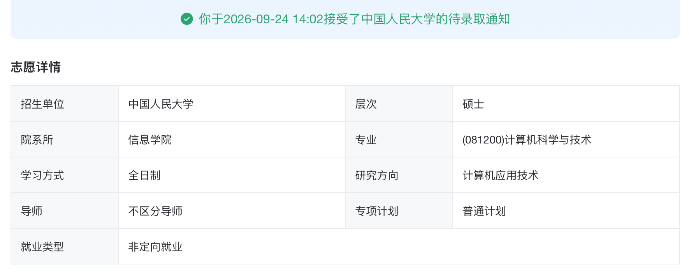

## 写在前面

先简单介绍一下个人background：

岳麓山下某9  
数学类专业  
专业加权排名 12%～15%  
六级460+  
一点mllm相关科研经历（无产出）  
xcpc 一银若干铜  
MCM 国赛国二、美赛 O奖  
若干省奖

（已经几乎在裸奔了，还是希望大家保护一下我）

结论先行。

先放个人最终去向：ruc信息学院-学硕

再说个人观察到的排序：
rk > 论文 > XCPC （其他竞赛帮助比较有限）

## 写在预推免之前

### icpc经历

大一时候的我对未来很迷茫，因为高中有过OI经历，所以大学稀里糊涂的就进了学校的icpc校队

进校队之后，我运气很好遇到了两个特别厉害的队友，带我在大二时就拿了银牌

同时认识了人很好的 luckyblock 学姐，为我之后的保研提供了很多的帮助

大二上打完icpc昆明的区域赛后，我当场做了一个到现在都有点后悔的决定，我选择退出了icpc校队

因为我当时还想专心学数学，未来走数学道路

### 数学经历

我高考填志愿的时候，我当时其实就对计算机和数学都很感兴趣，但是由于计算机非常热门，我高考的分数不足以支持我读985的计算机，于是我就选了数学这个专业

刚进校园，我满怀期待的以为大家都是对数学充满热爱

但事实并不是，连我自己也不是

从大一的数学分析、高等代数、实变函数、到大二的复变函数、点集拓扑，再到大三的抽象代数、泛函分析

我进一步认清了自己可能不适合做数学，我也不是真正的热爱数学

我在大二还想计划认真准备一下数学竞赛，但是根本没有动力

数学这条路，不仅需要一点天赋，更重要的是强烈的热爱与不懈的努力

### MCM 经历

MCM 就是数学建模竞赛

先说结论：这个比赛可以加综测分或者加保研分，但是对保研的帮助比较有限

我参加MCM的经历总结来看差不多就一年，25年夏天参加数模国赛

那时候一位大佬 zzkh 拉我打数模，我当时也没啥事情干，想着打一打玩一下

于是借助 GPT-5 的力量很幸运的拿到了国二的成绩

又在26年1月，bai拉上了hu和我一起参加MCM美赛

这也是我第一次参加美赛，感觉相比国赛，题目要恶心一点

不过好在有hu大佬，以及opus4.5的力量，再加上不知道哪里来的运气

最后也是拿下了O奖（获奖率 < 0.2%）

保研结束后来看，这个奖对我的保研帮助不是特别大

貌似拿来吹牛逼还有点用

###  决定跨保cs

其实在大一的时候，我还是有一次机会可以转专业到计算机的

但当时我从多方面考虑还是没有决定去转，既有对数学的痴迷也有对是否容易保研的考虑

上大三之后，随着对未来的考虑，以及对数学这条路的认识，我逐渐确定了要跨保

于是开始了解cs保研，开始知道有绿群的存在，开始知道这个赛道是多么的拥挤

刚进绿群那时候，群主做了一个保研定位网站，我看到上面大家的background，人均都有ccf-b以上的论文

迫于焦虑与压力，我也赶紧联系了几个本校老师，最终做了几个月的科研实习，虽然最后没什么产出，但是我对科研还是逐渐有了一些认识，认识了很多人很好的师兄，在我保研路上也提供了很多帮助

## 夏令营与预推免

有建议我直博的，也有建议我先读个硕士的，还有人说，如果没想好要不要读博，就说明还不适合读博

最后我也是在直博和硕士中选择了硕士，主要是学硕

所以在6月前，很多直博相关的夏令营都没有报名，也有很多报名了没有入的

### 夏令营

7月，我们学院安排了很折磨人的生产实习，在实习期间溜去参加了国科大叉院的夏令营，很巧的是国叉结束之后紧接就是人大信院学硕的预推免，于是我又顺路去参加了一下

详细的考核细节，xhs上应该已有很多帖子

最后获了国叉的优营以及人信不上不下的中等排名

参加完这两个后回来基本就是摆烂了，看大部分预推免还在8月9月

这期间就是一边焦虑一边摆烂

### 预推免

就这样一直到了8月，尝试报名了 sysu、seu、nju，基本都没入

很多华五基本都没报名，太自暴自弃了，现在看来应该都报名试一下的

当时既焦虑，又特别的自卑，简直陷入了绝境，报名预推免都感觉累的不行

sysu 和 seu 都没入，感觉自己特别的失败，害怕自己没学上于是又报了一个本校的预推免

后面还打算报名华科武大，但是就在我准备报名材料的那天早上，我打电话给人信教务，得知已经候补靠前，当时距离开始填志愿还有大概一周，所以说候补到的希望还是非常的大

我犹豫了一下，决定放弃华科的报名，回去准备开始摆烂

后面过了三天，我打电话问教务，结果我的候补排名依然没变

于是我开始担心万一没候补上，所以又报名了buaa cs，结果在机试完的那个下午收到电话

本来还想再参加一下buaa后续的面试，后面考虑到就算拿到offer也不去，想着选择把机会留给更多需要的人，于是放弃buaa面试，回到岳麓山下

预推免对我来说最大的教训之一就是：不要替招生办拒绝自己，能报名的就都尽量试一下

### 推免系统

后面的流程就是按照教务的安排填写系统

由于ruc是铁offer，所以只填写了一个志愿

最后也是一切顺利，拿到了拟录取

## 写在最后

本科三年，保研终于迎来了结束，有太多太多的感触以及想说的话

我第一次听说保研还是在高中毕业之后，那时候我就决心要保研了

也不是因为自己多么热爱科研，其实就是随波逐流被大家推着走

保研是一条不算轻松的道路，一路走过来，回看过去

依然感觉那些焦虑和痛苦挥之不去

不同的学校层次，不同的background，就会有不一样的经验

保研总体来说，不仅是实力的竞争，也是运气和信息差的战争

所以多看一些保研经验贴，多和学姐学长去交流

在这里我特别感谢几乎陪伴我整个保研路程的 luckyblock 学姐

不仅是我的保研导师，也是我人生的导师

感谢陪我保研的 zzkh 和 hu 两位大佬

感谢在组里提供帮助和鼓励的师兄师姐们

感谢一路走来所有提供帮助的人

祝读到这里的各位都有更好的前程和未来

其实保研结束后没打算写经验贴的

因为自己全过程没有很好的记录

而且感觉自己太菜，也没有什么值得参考的经验

但是想到前辈们大佬们的经验贴

我还是记录下来这点经历，供后人参考